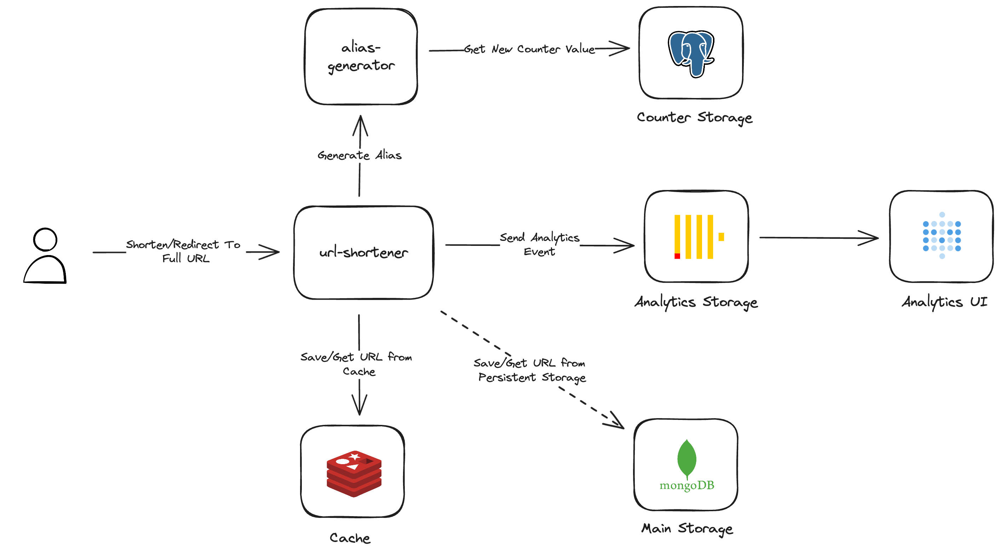

# URL Shortener

A scalable, ready-to-deploy URL shortener service built using Go. This project is designed to offer 
an easy-to-set-up URL shortening service with analytics infrastructure. It leverages Docker, 
PostgreSQL, ClickHouse, MongoDB, and Redis to ensure a robust and scalable system.

## Table of Contents

- [Features](#features)
- [Architecture](#architecture)
- [Endpoints](#endpoints)
- [Getting Started](#getting-started)
    - [Prerequisites](#prerequisites)
    - [Installation](#installation)
- [Usage](#usage)
- [Local Development](#local-development)
- [Contributing](#contributing)

## Features

- **Shorten URLs**: Generate unique and short aliases for URLs.
- **Analytics**: View analytics and metrics via Metabase dashboards.
- **Scalable Architecture**: Designed to scale horizontally to handle increased load.
- **Docker Compose Setup**: Easy setup and deployment using Docker Compose.

## Architecture



This project follows a monorepo structure containing two main services:

1. **URL-Shortener Service**:
    - Saves aliases to storage and cache (for the first 24 hours).
    - Retrieves the full URL based on the alias and redirects to it.

2. **Alias-Gen Service**:
    - Uses a counter-based approach to generate aliases for full URLs.
    - Employs PostgreSQL to maintain the counter value.

## Endpoints

- **Create Alias**:
    - `POST /url`
    - Example Request Body: `{"url": "https://github.com/"}`
    - Example Response: `{'status': 'OK', 'alias': 'alias'}`

- **Redirect to Full URL**:
    - `GET /{alias}`
    - Redirects to the corresponding full URL.

- **Delete Alias**:
    - `DELETE /{alias}`
    - Response: `HTTP 200 OK` on success, `HTTP 200 OK` with `error` message in response if the alias doesn't exist.
    - Removes the full URL and alias from the storages.

## Getting Started

### Prerequisites

- Docker and Docker Compose installed on your machine.
- Set up Cloud MongoDB and update its URI in the config file `services/main/config/production.yaml`.

### Installation

1. Clone the repository:
    ```bash
    git clone https://github.com/raisultan/url-shortener.git
    ```
2. Navigate to the project directory:
    ```bash
    cd url-shortener
    ```
3. Build and run the Docker Compose setup:
    ```bash
    docker-compose up --build -d
    ```
4. Set up Metabase on `localhost:3000` with the following credentials to create dashboards and monitor metrics:
    - Host: `clickhouse`
    - Port: `8123`
    - Username: `default`
    - Password: (leave empty)

### Usage

1. Access the URL shortener service at [http://localhost:8080](http://localhost:8080).
2. For analytics and metrics dashboards, access Metabase at [http://localhost:3000](http://localhost:3000).
    - The service tracks `clicks`, which include information like:
        - Redirect Timestamp
        - Alias
        - User IP address
        - User Agent
        - Referrer
        - Latency of Redirect
        - Error If Exists

### Local Development

Follow the steps in the [Local Development Setup](./docs/LOCAL_DEVELOPMENT.md) document to set up the project for local development.

### Contributing

Contributions are welcome! Here's how you can contribute:

1. Fork the Project
2. Create your Feature Branch (`git checkout -b feature/AmazingFeature`)
3. Commit your Changes (`git commit -m 'Add some AmazingFeature'`)
4. Push to the Branch (`git push origin feature/AmazingFeature`)
5. Open a Pull Request
